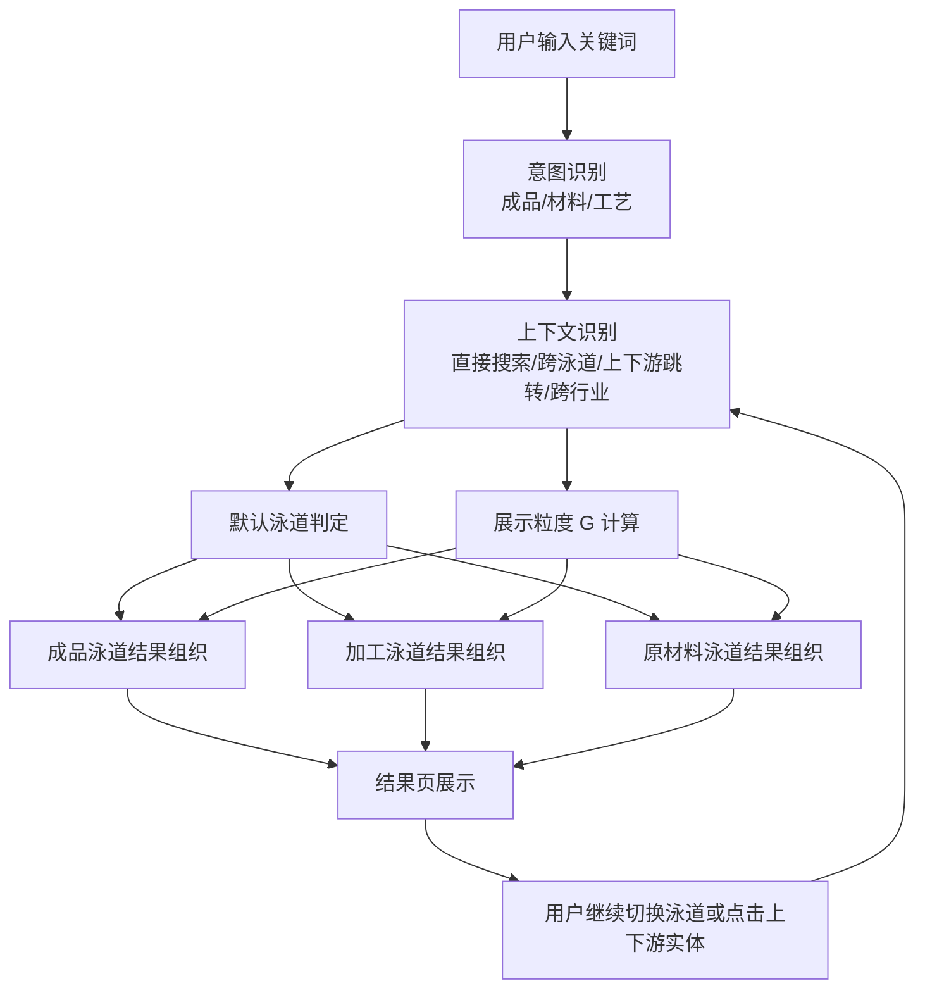
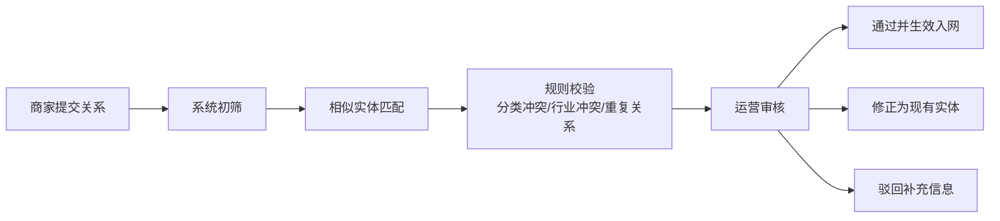
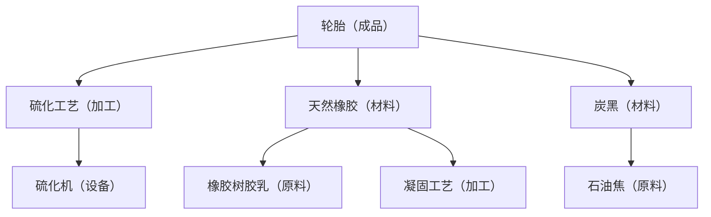
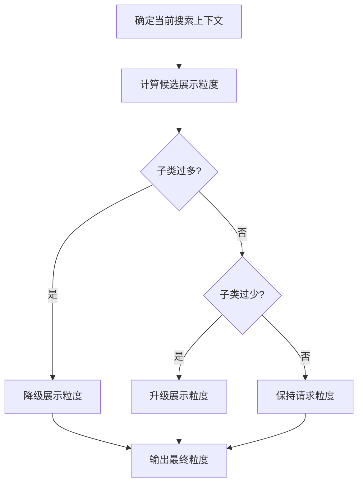
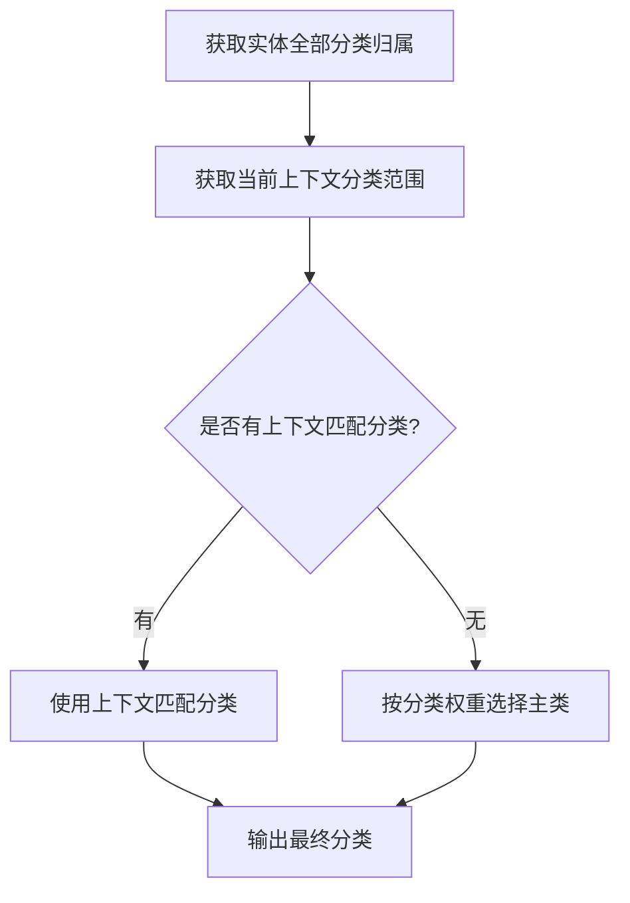

# 五金商城三泳道动态分类与搜索即溯源 PRD

## 1. 文档概述

### 1.1 文档信息

| 项目 | 内容 |
| --- | --- |
| 文档名称 | 五金商城三泳道动态分类与搜索即溯源 PRD |
| 文档类型 | 专题 PRD |
| 版本 | V1.0 |
| 状态 | 待评审 |
| 更新时间 | 2026-04-01 |
| 适用范围 | 用户商城小程序、商家 Web 端、平台运营端中与三泳道动态分类系统直接相关的模块 |

### 1.2 文档目标

本文档用于定义“五金商城三泳道动态分类与搜索即溯源”专题能力，明确业务目标、核心概念、三端功能方案、数据与控制规则、异常处理与验收标准，作为产品、研发、设计、测试、运营共同评审和落地的依据。

### 1.3 文档定位

本 PRD 为专题 PRD，不覆盖整站商城全部功能，仅聚焦以下能力：

- 搜索入口与搜索结果组织
- 成品 / 加工 / 原材料三泳道展示与切换
- 产业链上下游跳转与溯源展示
- 商家关系数据供给与运营审核配置
- 动态粒度控制、分类冲突处理、跨行业差异提示

### 1.4 相关输入材料

- 本地功能清单：`商城功能清单_三端整合_20260206(2).xlsx`
- 本地需求记录：`需求跟踪文档.txt`
- 沙盘推演数据：轮胎橡胶产业链、医用乳胶手套产业链、后台控制逻辑

## 2. 项目背景与问题定义

### 2.1 业务背景

现有 B 端商城搜索体验仍以“平铺商品列表”为主，用户能看到大量商品，但无法快速理解“某个成品需要哪些上游材料、对应哪些加工环节、哪些供应商具备供给能力”。对于制造类采购，尤其是五金、橡胶、工业配套等产业，用户的真实需求往往不是简单找商品，而是找整条制造链上的可采购资源。

### 2.2 当前问题

当前搜索模式存在以下问题：

- 搜索结果无法区分用户是在找成品、加工服务还是原材料
- 同一关键词在不同行业语境下含义不同，系统无法做出有针对性的展示
- 商品分类树只能支持单一电商浏览逻辑，无法表达产业链上下游关系
- 商家缺少结构化关系录入与维护能力，平台无法沉淀产业图谱数据
- 用户从一个结果跳到另一个结果时，上下文丢失，不能形成“搜索即溯源”的连续体验

### 2.3 机会点

通过构建三泳道动态分类系统，平台可将搜索结果升级为产业链入口：

- 识别用户意图并动态选择最合适的默认泳道
- 在结果页同时呈现成品、工艺、原材料三种视角
- 支持从当前节点查看上游、下游和同类替代关系
- 将运营维护的分类树、实体关系和商家供给数据沉淀为长期数据资产

## 3. 产品目标与成功指标

### 3.1 产品目标

本专题能力的目标如下：

1. 让用户在一次搜索中即可看到成品、加工、原材料三个角度的结果组织方式。
2. 让用户能从某个成品快速理解其上游材料和关键加工环节。
3. 让用户能从某种材料或工艺反向找到其适配行业、规格和供应商。
4. 让商家和平台运营共同参与产业链关系数据建设，持续提升搜索质量。
5. 实现“搜索即溯源”，让搜索结果页成为产业链认知和交易转化入口。

### 3.2 成功指标

| 指标 | 目标值 | 说明 |
| --- | --- | --- |
| 用户搜索满意度 | > 4.5 / 5.0 | 通过结果页满意度评价、问卷或回访问卷统计 |
| 制造链查看率 | > 30% | 搜索结果页中进入材料 / 工艺 / 溯源详情的用户占比 |
| 分类准确率 | > 90% | 搜索意图判定与类目展示符合预期的比例 |
| 结果页平均响应时间 | < 2 秒 | 热门搜索场景 P95 响应时间 |
| 商家关系完善度覆盖率 | 阶段性提升 | 接入行业内完成关键关系配置的商家比例 |

## 4. 用户角色与核心场景

### 4.1 用户角色

| 角色 | 目标 | 关注点 |
| --- | --- | --- |
| 采购用户 | 找成品、找上游材料、找加工服务、找供应商 | 结果相关性、行业差异提示、供应商可信度 |
| 商家运营人员 | 录入商品、维护上下游关系、获得流量 | 录入效率、系统纠错、曝光与转化 |
| 平台运营 | 维护分类体系、审核关系、调整策略 | 数据质量、搜索表现、风险控制 |

### 4.2 核心使用场景

- 场景 A：用户直接搜索“天然橡胶”，系统识别为材料视角，展示其规格级供应结果。
- 场景 B：用户搜索“轮胎”后切换到原材料 Tab，快速了解轮胎制造需要哪些材料大类。
- 场景 C：用户在轮胎原材料列表中点击“天然橡胶”，进入新的上下文搜索页面查看详细规格。
- 场景 D：用户搜索“医用乳胶手套”后查看原材料，系统突出医用级原料标准，并主动提示与轮胎用橡胶差异。

## 5. 核心概念定义

### 5.1 三泳道定义

| 概念 | 定义 |
| --- | --- |
| 成品泳道 | 展示用户最终采购对象，如轮胎、手套、紧固件、设备成品等 |
| 加工泳道 | 展示某产品或材料涉及的加工环节、工艺服务、工艺能力 |
| 原材料泳道 | 展示生产成品所需的直接材料、上游原料及其供应能力 |

### 5.2 实体类型

| 实体类型 | 示例 |
| --- | --- |
| 成品 | 汽车轮胎、医用乳胶手套 |
| 材料 | 天然橡胶、炭黑、帘线材料 |
| 工艺 | 硫化工艺、浸渍工艺、凝固工艺 |
| 设备 | 硫化机、造粒机、凝固槽 |
| 原料 | 橡胶树胶乳、石油焦 |

### 5.3 关系类型

| 关系类型 | 含义 | 示例 |
| --- | --- | --- |
| 需要 | 下游依赖上游实体 | 轮胎需要天然橡胶 |
| 属于 | 实体的分类归属 | STR20 属于天然橡胶 |
| 上游来源 | 某实体的直接来源 | 天然橡胶来源于橡胶树胶乳 |
| 工艺依赖 | 某材料或成品依赖特定工艺 | 轮胎依赖硫化工艺 |
| 行业适用 | 同一实体在多个行业中被使用 | 硫化工艺适用于轮胎与手套 |

### 5.4 搜索上下文

| 上下文 | 定义 |
| --- | --- |
| 直接搜索 | 用户直接输入关键词发起查询 |
| 跨泳道点击 | 在当前结果页中切换到其他泳道查看同一关键词的不同视角 |
| 上下游跳转 | 从一个实体跳转查看其上游或下游实体 |
| 跨行业对比 | 同一实体在不同应用行业中展示不同标准与风险提醒 |

### 5.5 展示粒度 G

| 粒度 | 定义 | 典型展示 |
| --- | --- | --- |
| G=1 | 展示大类 | 橡胶类、炭黑类、化工助剂类 |
| G=2 | 展示子类或典型规格 | 天然橡胶、合成橡胶、N330、N550 |
| G=3 | 展示具体规格型号 | STR20、RSS3、205/55R16、灭菌外科级 |

### 5.6 分类体系

- 成品分类树：面向最终成品商品
- 材料分类树：面向原材料、原料、规格分类
- 工艺分类树：面向工艺大类、工艺子类、适用场景
- 分类映射关系表：用于实体在多棵分类树和多行业场景中的归属映射

### 5.7 特殊标记

| 标记 | 含义 |
| --- | --- |
| 多行业适用 | 同一实体适用于多个行业，需展示行业差异 |
| 不可互换 | 虽名称相关或来源相同，但因标准不同不可直接替代 |
| 高风险采购提醒 | 存在采购误用风险，需展示显著提示 |

## 6. 总体方案概述

### 6.1 方案说明

用户输入关键词后，系统先做意图识别和上下文识别，再决定默认泳道、展示粒度和补充提示；随后按照三泳道并行组织结果，并根据用户的点击行为持续更新上下文，使“当前关键词”成为新的搜索起点。

### 6.2 总体流程图



### 6.3 核心设计原则

- 默认给结果，不让用户先理解复杂逻辑再使用
- 展示粒度跟随上下文变化，避免信息过载
- 同名实体在不同行业下优先展示正确标准和警示
- 平台可配置、商家可供数、用户端可逐步深入

## 7. 用户端方案

### 7.1 页面范围

本专题在用户端覆盖以下页面：

- 搜索入口页
- 搜索结果页
- 上下游详情跳转页
- 原材料 / 工艺详情页
- 溯源图谱入口与详情页

### 7.2 搜索入口页

#### 7.2.1 页面目标

降低搜索门槛，引导用户输入关键词并快速进入最相关的泳道结果。

#### 7.2.2 功能要求

- 支持关键词输入
- 展示搜索历史
- 展示热搜词、榜单入口
- 支持图搜入口，但 V1 仅保留占位或“即将上线”提示
- 支持从首页模块进入搜索，如大分类、低价特卖、榜单等

### 7.3 搜索结果页

#### 7.3.1 页面组成

- 搜索词输入框
- 三泳道 Tab：成品 / 加工 / 原材料
- 系统判定说明区
- 结果主列表区
- 上下文提示区
- 推荐联想区
- 溯源图谱入口

#### 7.3.2 默认泳道判定规则

| 场景 | 默认泳道 | 默认粒度 |
| --- | --- | --- |
| 直接搜索成品词，如“轮胎” | 成品泳道 | G=3 |
| 直接搜索材料词，如“天然橡胶” | 原材料泳道 | G=3 |
| 直接搜索工艺词，如“硫化” | 加工泳道 | G=2 |
| 从成品跳到材料 | 原材料泳道 | G=1 或 G=2 |
| 从材料跳到工艺 | 加工泳道 | G=2 |
| 跨行业高风险实体 | 按上下文判定 | 强制显示行业差异提示 |

#### 7.3.3 系统判定解释文案

为降低用户理解成本，结果页需显示系统判定说明，例如：

- “系统判定：您正在查找成品规格，优先展示最细粒度结果”
- “系统判定：您从轮胎查看所需材料，先展示材料大类，便于快速浏览”
- “系统判定：该材料跨多个行业使用，请确认应用场景后查看供应商”

### 7.4 三泳道结果呈现规则

#### 7.4.1 成品泳道

- 展示用户直接采购对象
- 默认按类目、规格、品牌组织
- 当用户直接搜索成品词时，优先展示 G=3 结果
- 当材料或工艺成为新搜索词时，成品泳道展示该材料 / 工艺所关联的下游成品

#### 7.4.2 加工泳道

- 展示与当前实体直接相关的加工工艺
- 默认展示工艺大类与典型能力，不展示过细参数
- 若用户直接搜索工艺词，可展示典型设备、关键参数范围、适用行业

#### 7.4.3 原材料泳道

- 展示当前成品或工艺所依赖的材料视角
- 从成品跳转查看时，优先展示 G=1 或 G=2
- 直接搜索材料词时，展示 G=3 到规格与供应商层级
- 对跨行业高风险材料，必须展示标准差异、不可互换提示和比对入口

### 7.5 上下文提示区

用户从某个实体跳到另一个实体时，页面必须保留来源说明，例如：

- 来自：轮胎 → 橡胶类 → 天然橡胶
- 当前视角：查看“天然橡胶”的详细规格与供应商

同时提供快捷入口：

- 返回上一步
- 查看加工工艺
- 查看上游原料
- 查看溯源图谱

### 7.6 跨行业差异提示

系统必须支持在同名材料跨行业时做差异提示。

示例：天然橡胶在轮胎行业与医用手套行业中的展示差异：

- 轮胎行业强调机械强度、杂质容忍度、轮胎级规格
- 医用行业强调蛋白含量、生物相容性、FDA / CE 等认证
- 页面需突出“不可以轮胎级替代医用级”的警示

### 7.7 供应商动作入口

结果页与详情页中需提供以下标准动作：

- 查看详细规格
- 联系供应商
- 查看全部供应商

### 7.8 溯源图谱入口

V1 将溯源图谱作为增强能力接入：

- 在搜索结果页提供入口
- 支持展示成品到工艺、材料、原料的链路
- 不作为搜索主流程唯一依赖

### 7.9 四种典型场景展示

#### 场景 A：直接搜索“天然橡胶”

```text
┌─────────────────────────────────────────────────────────────────────┐
│ 🔍 天然橡胶                                            [搜索历史▼] │
├─────────────────────────────────────────────────────────────────────┤
│ ● 成品(156)    ○ 加工(8)    ○ 原材料(5)                           │
│ 系统判定：您把“天然橡胶”当作具体采购对象，展示规格型号             │
│                                                                     │
│ 【天然橡胶 - 按规格分类】                                           │
│ ▼ 泰国天然橡胶（89家供应商）                                        │
│   ├─ 泰国STR20 标准胶                                               │
│   ├─ 泰国RSS3 烟片胶                                                │
│   └─ 泰国SVR3L 浓缩胶乳                                             │
│                                                                     │
│ ▼ 马来西亚天然橡胶（45家供应商）                                    │
│ ▼ 中国海南天然橡胶（22家供应商）                                    │
└─────────────────────────────────────────────────────────────────────┘
```

设计要求：

- 直接搜索材料词时默认展示规格级结果
- 同时保留切换到加工 / 原材料视角的入口

#### 场景 B：搜索“轮胎”后切到原材料 Tab

```text
┌─────────────────────────────────────────────────────────────────────┐
│ 🔍 轮胎                                                [清除][搜索] │
├─────────────────────────────────────────────────────────────────────┤
│ ○ 成品(850)    ○ 加工(12)    ● 原材料(19)                         │
│ 系统判定：您从“轮胎”查看需要什么材料，展示大类即可                 │
│                                                                     │
│ 【轮胎制造所需原材料 - 按类别】                                     │
│ 橡胶类（核心材料）                                                  │
│ ├─ 天然橡胶（45家）                                                 │
│ ├─ 合成橡胶（40家）                                                 │
│ └─ 再生橡胶（12家）                                                 │
│                                                                     │
│ 骨架材料类                                                          │
│ ├─ 钢丝帘线（18家）                                                 │
│ ├─ 聚酯帘线（10家）                                                 │
│ └─ 尼龙帘线（4家）                                                  │
└─────────────────────────────────────────────────────────────────────┘
```

设计要求：

- 不直接展开 STR20、RSS3 等细规格
- 材料视角强调“看大类、知结构、可继续深入”

#### 场景 C：从场景 B 点击“天然橡胶”进入新页面

```text
┌─────────────────────────────────────────────────────────────────────┐
│ ← 返回轮胎原材料    🔍 天然橡胶（来自：轮胎→橡胶类）                 │
├─────────────────────────────────────────────────────────────────────┤
│ ● 成品(156)    ○ 加工(8)    ○ 原材料(5)                           │
│ 系统判定：现在“天然橡胶”成为新的搜索起点，展示其具体规格           │
│                                                                     │
│ [返回轮胎] [查看天然橡胶的加工工艺] [查看天然橡胶的上游原料]       │
│                                                                     │
│ ▼ 泰国天然橡胶（89家供应商）...                                     │
└─────────────────────────────────────────────────────────────────────┘
```

设计要求：

- 新页面中“天然橡胶”成为当前主搜索词
- 页面需保留来源上下文和返回路径

#### 场景 D：搜索“医用乳胶手套”后切到原材料 Tab

```text
┌─────────────────────────────────────────────────────────────────────┐
│ 🔍 医用乳胶手套                                                    │
├─────────────────────────────────────────────────────────────────────┤
│ ○ 成品(45)     ○ 加工(6)     ● 原材料(8)                          │
│                                                                     │
│ 【医用乳胶手套制造所需原材料 - 严格医疗级标准】                      │
│ 乳胶材料类（占比高）                                                │
│ ├─ 医用级天然橡胶浓缩胶乳（18家）                                   │
│ ├─ 合成聚异戊二烯橡胶（5家）                                        │
│ └─ [对比轮胎用天然橡胶]                                             │
│                                                                     │
│ 行业差异提示：轮胎用 STR20 因杂质含量高，不可用于医用手套           │
└─────────────────────────────────────────────────────────────────────┘
```

设计要求：

- 必须显示行业差异和不可互换提示
- 支持查看详细对比和寻找跨标准供应商

## 8. 商家端方案

### 8.1 目标

让商家低成本参与产业链关系建设，并通过完善关系获得更多曝光和转化。

### 8.2 功能范围

#### 8.2.1 实体录入与维护

- 商品实体录入
- 材料实体录入
- 工艺实体录入
- 规格、属性、适用行业、认证信息维护

#### 8.2.2 上下游关系配置

- 配置“成品需要材料”
- 配置“成品需要工艺”
- 配置“材料来源于原料”
- 配置“工艺依赖设备”

#### 8.2.3 溯源数据上传与编辑

- 上传关系数据
- 编辑已有关系
- 查看系统识别出的关联建议

#### 8.2.4 标准实体自动匹配与纠错

- 商家输入实体时，系统返回相似实体建议
- 商家可直接关联标准实体，避免重复创建
- 对疑似错误命名、行业冲突、低相似度匹配给出提示

#### 8.2.5 关系完善度评分

平台根据以下维度形成商家关系完善度：

- 关键实体是否完整
- 主要上游是否覆盖
- 行业标准是否补充
- 认证、规格、应用说明是否齐全

#### 8.2.6 一键导入工具

- 支持 Excel 模板导入关系数据
- 支持从现有商品结构中批量生成关系草稿
- 支持平台模板行业初始化

#### 8.2.7 数据报表

商家端需提供以下报表：

- 搜索曝光
- 溯源曝光
- 咨询线索
- 订单转化
- 不同关系完善度下的流量表现

### 8.3 激励规则

- 关系完善度高的商家，在相关搜索中获得更优展示机会
- 平台可在行业样板专区展示关系完善的标杆商家
- 对未完善关键关系但参与重要行业的商家，运营给予补录引导

## 9. 平台运营端方案

### 9.1 目标

平台运营端负责维护知识结构、审核商家关系、配置展示规则和监控效果，是三泳道系统的控制中心。

### 9.2 分类体系维护

#### 9.2.1 三套分类树

运营端需维护以下分类体系：

- 成品分类树
- 材料分类树
- 工艺分类树

#### 9.2.2 分类树预设示例

成品分类树：

- 汽车配件
  - 轮胎
    - 汽车轮胎
    - 自行车轮胎
    - 工程轮胎

材料分类树：

- 橡胶材料
  - 天然橡胶
    - STR20
    - RSS3
    - 烟片胶

工艺分类树：

- 橡胶加工
  - 硫化工艺
    - 低温硫化
    - 高温硫化

#### 9.2.3 分类映射关系表

为解决实体多归属问题，平台需维护映射关系表，支持：

- 同一实体映射多个分类树节点
- 记录行业语境下的优先归属
- 配置默认主类、次类和风险标记

### 9.3 行业模板预设

V1 需优先预设以下行业模板：

- 轮胎橡胶行业模板
- 医用乳胶行业模板

模板应包含：

- 核心成品
- 关键工艺
- 原材料大类
- 典型规格
- 风险提醒
- 推荐搜索词

### 9.4 泳道粒度阈值配置

运营端支持按泳道和行业配置展示层级上限。

| 配置项 | 说明 |
| --- | --- |
| 成品泳道最大层级 | 默认展示到规格层，避免过度下钻 |
| 工艺泳道最大层级 | 默认展示工艺大类与典型能力 |
| 原材料泳道动态层级 | 按搜索上下文动态展示 G=1 / G=2 / G=3 |
| 特殊行业强制层级 | 医疗器械、汽车等行业可强制显示特定粒度 |

### 9.5 搜索规则与权重策略

平台端需支持以下规则配置：

- 意图识别词典与实体别名
- 搜索排序权重，如销量、相关度、关系完善度、认证情况
- 跨行业风险提示的触发条件
- 热搜词与推荐词配置

### 9.6 关系审核流程



平台需支持：

- 待审核列表
- 系统建议实体
- 风险说明
- 联系商家核实
- 修正已有关系或创建新实体

### 9.7 风险阻断规则

平台端需能配置并执行以下风险规则：

- 分类冲突阻断
- 行业标准冲突阻断
- 高风险替代采购提示
- 同义词误判修正
- 异常曝光或错误映射回滚

### 9.8 监控看板

运营看板至少展示：

- 搜索满意度
- 制造链查看率
- 分类准确率
- 平均响应时间
- 关系审核通过率
- 高风险提示触发次数

## 10. 数据模型与后台控制逻辑

### 10.1 主案例：轮胎橡胶产业链

#### 10.1.1 实体关系网络



#### 10.1.2 扩展网络结构

- 层级 0：成品，如汽车轮胎
- 层级 1：直接上游，包括加工工艺和材料大类
- 层级 2：关键工艺或材料的上游，如设备、辅料、直接原料
- 层级 3：进一步追溯源头，如钢材、天然气、种植等

### 10.2 对比案例：医用乳胶手套产业链

#### 10.2.1 核心结构

- 成品：医用乳胶手套
- 工艺：浸渍工艺、硫化工艺、表面处理、包装灭菌
- 原材料：医用级天然橡胶浓缩胶乳、化学添加剂、后处理材料

#### 10.2.2 跨行业关联点

- 硫化工艺在轮胎与手套行业中原理相似，但参数和设备不同
- 天然橡胶拥有共同上游来源，但因加工路径不同形成不同标准
- 页面需突出“同源不同标，不可直接替代”

### 10.3 双产业链交汇点

| 实体 | 交汇价值 | 系统策略 |
| --- | --- | --- |
| 橡胶树胶乳 | 轮胎、医用、工业制品共用上游 | 标记为高价值交汇实体 |
| 硫化工艺 | 多行业适用，但参数差异大 | 标记“多行业适用”，展示差异说明 |
| 天然橡胶 | 同源但不同标准 | 标记“不可互换”并触发风险提示 |

### 10.4 粒度自适应控制逻辑



规则定义：

- 直接搜索优先细粒度
- 从下游看上游优先粗粒度
- 子类过多时降低粒度，避免页面爆炸
- 子类过少时提升粒度，避免页面信息不足

### 10.5 分类冲突处理逻辑



冲突处理原则：

- 优先使用与上下文匹配的分类
- 其次使用权重最高的分类
- 平台可人工修正归属和行业适用标签

### 10.6 关键伪代码

#### 10.6.1 分类冲突处理

```python
def resolve_category_conflict(entity, context):
    base_categories = get_entity_categories(entity)
    context_categories = get_context_categories(context)

    for cat in base_categories:
        if cat in context_categories:
            return cat

    return max(base_categories, key=lambda x: x.weight)
```

#### 10.6.2 粒度自适应调整

```python
def adaptive_granularity(category, requested_level):
    child_count = len(category.children)

    if child_count > 50 and requested_level > 2:
        return min(requested_level, 2)
    elif child_count < 5 and requested_level == 1:
        return 2
    else:
        return requested_level
```

## 11. 异常处理与风险控制

### 11.1 技术风险

#### 11.1.1 数据一致性风险

风险说明：

- 三套分类树可能不同步
- 实体映射关系可能漏配或错配

应对策略：

- 建立分类映射关系表
- 建立定期一致性巡检
- 分类变更时自动触发联动更新

#### 11.1.2 性能风险

风险说明：

- 动态计算意图、粒度、跨行业关系可能导致响应变慢

应对策略：

- 热点数据缓存
- 常用查询预计算
- 结果分级加载
- 高频行业模板优先缓存

### 11.2 业务风险

#### 11.2.1 商家接受度风险

风险说明：

- 商家可能不愿完善产业链关系数据

应对策略：

- 关系完善度与流量挂钩
- 提供一键导入工具
- 建立标杆商家案例专区

#### 11.2.2 用户理解成本风险

风险说明：

- 用户可能不了解三泳道逻辑，不理解为何结果会变化

应对策略：

- 展示系统判定说明
- 给出清晰返回路径与上下文提示
- 渐进式披露复杂内容
- 使用合理默认值，减少手动决策

#### 11.2.3 错误采购风险

风险说明：

- 同名材料在不同行业标准下不可互换，存在采购误用风险

应对策略：

- 对关键实体打上“不可互换”标记
- 展示行业差异与警示文案
- 平台对高风险组合启用阻断或二次确认

## 12. 范围边界与分期建议

### 12.1 本期纳入范围

- 搜索入口、热搜词、历史搜索
- 三泳道搜索结果组织与切换
- 上下游实体跳转与上下文承接
- 行业模板、分类树、关系映射表
- 商家关系供数与运营审核
- 粒度配置、分类冲突、风险提示
- 指标看板和基础效果监控

### 12.2 本期不做详细设计

- 完整交易链路的改造细节
- 会员、积分、分销、社区的全量规则
- IM 客服系统完整能力
- 图搜真实识别算法
- 自动知识图谱全量生成

上述能力如对专题流程有影响，仅在依赖关系中简述，不在本 PRD 中展开详细交互和规则。

### 12.3 分期建议

#### V1：规则驱动版

- 行业模板预设
- 三泳道结果页
- 粒度与分类冲突基础规则
- 商家关系录入与审核
- 基础监控指标

#### V2：数据增强版

- 更多行业模板
- 更丰富的推荐词和行业差异提示
- 商家导入工具优化
- 溯源图谱体验升级

#### V3：智能化增强版

- 行为驱动的动态排序优化
- 自动推荐上下游关系
- 更强的行业知识图谱联想能力

## 13. 验收标准

### 13.1 场景验收

| 编号 | 验收场景 | 预期结果 |
| --- | --- | --- |
| AC-01 | 搜索“轮胎” | 默认进入成品泳道，展示最细规格层级 |
| AC-02 | 从“轮胎”切换到原材料泳道 | 展示材料大类，不直接展开全部细规格 |
| AC-03 | 搜索“天然橡胶” | 展示规格级结果和供应商，不误判为轮胎材料总览页 |
| AC-04 | 从“轮胎”点击“天然橡胶” | 新页面保留来源上下文，可继续查看加工与上游原料 |
| AC-05 | 搜索“医用乳胶手套”后切原材料泳道 | 突出医用级标准，不混入轮胎级材料 |
| AC-06 | 同一实体存在多分类 | 系统按上下文优先判定，无法判定时按权重回退 |
| AC-07 | 商家提交新关系 | 系统给出相似实体建议并进入审核流 |
| AC-08 | 运营修改粒度阈值 | 前台展示层级按新配置生效 |

### 13.2 指标验收

- 搜索满意度大于 4.5 / 5.0
- 制造链查看率大于 30%
- 分类准确率大于 90%
- 热门搜索场景结果页平均响应时间小于 2 秒

### 13.3 文档假设说明

- 文中供应商数量、占比、规格数等为沙盘示例数据，用于表达规则，不作为上线前固定业务数值。
- V1 以规则驱动和运营配置为主，不要求首版上线复杂算法模型。
- 本文档所涉及用户端、商家端、平台端能力均以专题实现所需最小闭环为边界。

## 附录 A：典型行业数据预设

### A.1 轮胎橡胶产业链预设

- 轮胎（成品）
  - 需要硫化工艺
    - 需要硫化机
  - 需要天然橡胶
    - 需要橡胶树胶乳
    - 需要凝固工艺
  - 需要炭黑
    - 需要石油焦

### A.2 医用乳胶手套产业链预设

- 医用乳胶手套（成品）
  - 需要浸渍工艺
  - 需要硫化工艺
  - 需要医用级天然橡胶浓缩胶乳
  - 需要化学添加剂与后处理材料

## 附录 B：专题结论

通过三泳道动态分类与搜索即溯源能力，平台可以把“搜索框”升级为“产业链导航入口”。用户获得更准确的采购视角，商家获得更明确的数据建设方向，平台则沉淀可持续扩展的行业关系网络与搜索规则资产。该能力适合作为五金商城差异化竞争点优先建设，并以行业模板方式逐步推广到更多制造链场景。
